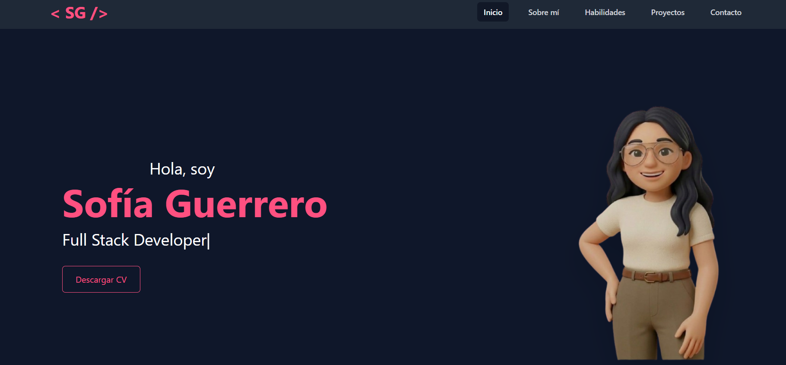

<h1 align="center">💻 Portfolio Personal</h1>

<h3 align="center">
Sofía Guerrero | Desarrolladora Full Stack en formación
</h3>

<p align="center">
  Estudiante de la Tecnicatura Universitaria en Programación (UTN-FRT)
</p>

---

## 👋 Sobre mí

Soy una desarrolladora Full Stack en formación apasionada por la tecnología, el aprendizaje continuo y la resolución de problemas.

Disfruto crear aplicaciones web combinando diseño, lógica de negocio y bases de datos para desarrollar soluciones funcionales y escalables.

Actualmente continúo fortaleciendo mis conocimientos en desarrollo web, bases de datos y buenas prácticas de programación.

---

## 🚀 Tecnologías

<p align="center">


</p>

---

## ✨ Características del Portfolio

✔️ Diseño moderno y responsive

✔️ Presentación profesional

✔️ Sección de habilidades técnicas

✔️ Proyectos destacados

✔️ Información de contacto

✔️ Navegación intuitiva

✔️ Animaciones e interacción visual

---

## 📸 Vista Previa

<p align="center">
  
</p>

---

## 🌐 Demo

🔗 **Portfolio Online**

[Ver Portfolio](AQUÍ_TU_URL)

---

## ⚙️ Instalación

### Clonar repositorio

```bash
git clone https://github.com/AnaSofi03/portafolioSofia.git
```

### Ingresar al proyecto

```bash
cd portafolioSofia
```

### Instalar dependencias

```bash
npm install
```

### Ejecutar proyecto

```bash
npm run dev
```


## 📫 Contacto

<p align="center">

<a href="https://github.com/AnaSofi03">
GitHub
</a>

•

<a href="https://www.linkedin.com/in/ana-sofia-guerrero-16764625b/">
LinkedIn
</a>

</p>

---

<p align="center">
⭐ Gracias por visitar mi portfolio
</p>
